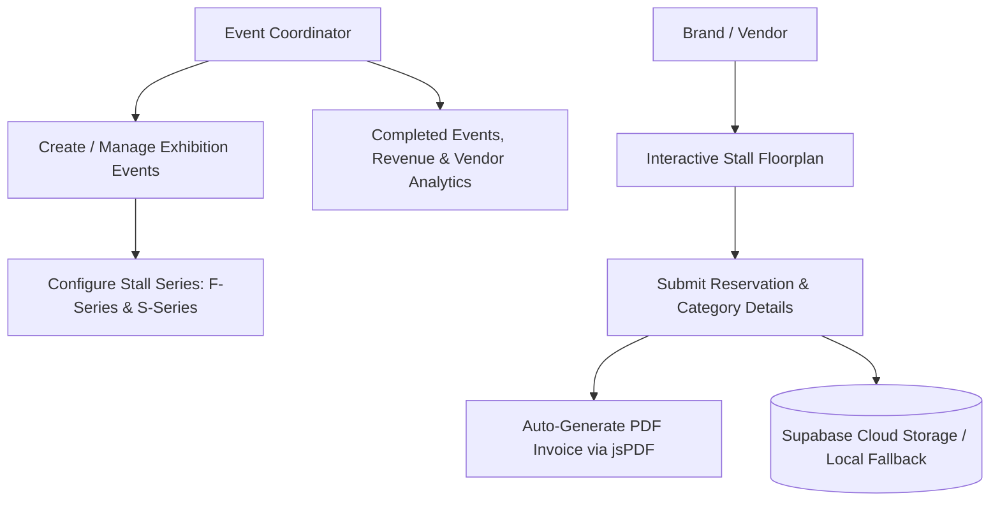

# Velvet Trunk: Luxury Exhibition & Vendor Stall Booking Platform 🎪✨

<div align="center">

[](https://react.dev)
[](https://www.typescriptlang.org/)
[](https://supabase.com/)
[](https://tailwindcss.com/)
[](https://github.com/parallax/jsPDF)
[](https://motion.dev/)

**Comprehensive Stall Reservation, Vendor Onboarding & Exhibition Management Platform for Velvet Trunk Lifestyle Flea Markets.**

</div>

---

## 📖 Overview

**Velvet Trunk** is a premier curator of high-end lifestyle, fashion, and artisanal flea exhibitions. Managing dozens of prospective vendors across multi-day luxury pop-up events requires strict stall allocation, payment verification, and clear communications.

Engineered by **A Generative Slice**, this platform digitizes the entire exhibition operations pipeline. Event organizers can schedule city exhibitions, define stall categories (Premium Front-Facing F-Series vs. Standard Artisanal S-Series), process vendor registrations, issue instant branded PDF invoices, and sync reservations with a cloud **Supabase** database.

---

## 🌟 Key Functional Pillars



### 1. 🎪 Exhibition Lifecycle Management
- Manage upcoming, live, and past exhibitions across different convention centers and cities.
- Track total stall capacity, occupied booths, and revenue milestones per venue.

### 2. 📍 Interactive Stall Series (F-Series & S-Series)
- **F-Series (Front-Row / Premium)**: High-footfall entrance stalls for luxury fashion, fine jewelry, and anchor brands.
- **S-Series (Standard / Artisanal)**: Curated booths for handcrafted accessories, gourmet foods, and boutique crafts.

### 3. 📄 Automated PDF Booking Vouchers
- Client-side invoice compilation via **jsPDF** generating formal confirmation receipts with event terms, stall numbers, and organizer contact details.

### 4. 🔄 Hybrid Storage Architecture
- Connects directly to **Supabase** for real-time cloud data persistence while retaining robust offline local storage fallbacks (`lib/storage.ts`).

---

## 🛠️ Technology Stack

| Layer | Technology |
|---|---|
| **Frontend Framework** | React 19 with Fast Refresh |
| **Language** | TypeScript strict typing |
| **Styling** | Tailwind CSS v4 with PostCSS |
| **Animations** | Motion (Framer Motion v12) |
| **Database** | Supabase (`@supabase/supabase-js`) |
| **PDF Generation** | jsPDF |
| **Icons** | Lucide React |
| **Bundler** | Vite 6 |

---

## 📂 Repository Structure

```
VelvetTrunk/
├── public/                     # Static media and brand graphics
├── src/
│   ├── components/             # Screen views & UI elements
│   │   ├── Navigation.tsx      # Top tab bar navigation
│   │   ├── HomeView.tsx        # Active exhibitions dashboard
│   │   ├── CreateEventView.tsx # Exhibition creation wizard
│   │   ├── SeriesStallsView.tsx # F-Series & S-Series stall grid
│   │   ├── EventDetailsView.tsx # Specific event analytics & roster
│   │   └── SupabaseModal.tsx   # Cloud sync configuration modal
│   ├── lib/                    # Supabase client & local storage sync logic
│   ├── types.ts                # Event, Stall, and Vendor type contracts
│   ├── App.tsx                 # Core application state orchestrator
│   └── main.tsx                # Application mount point
├── velvettrunklogo.png         # High-resolution brand crest
├── package.json                # Dependencies and npm scripts
├── vite.config.ts              # Vite bundler configuration
└── .env.example                # Environment variable template
```

---

## 🚀 Getting Started

### Prerequisites
- Node.js v18 or later
- npm v9 or later

### Installation & Development

```bash
# 1. Clone repository
git clone https://github.com/A-Generative-Slice/VelvetTrunk.git
cd VelvetTrunk

# 2. Install dependencies
npm install

# 3. Start development server
npm run dev
```

Visit `http://localhost:3000` to interact with the platform.

---

## ⚙️ Environment Variables (Optional Supabase Sync)

Create a `.env` file to sync bookings to a remote Supabase instance:

```env
VITE_SUPABASE_URL=https://your-project.supabase.co
VITE_SUPABASE_ANON_KEY=your_supabase_anon_key
```

*(Note: If Supabase credentials are not provided, the platform gracefully operates in local storage mode.)*

---

## 📄 License & Attribution

Designed and engineered by **A Generative Slice** for **Velvet Trunk**.  
Copyright © 2026 Velvet Trunk & A Generative Slice. All rights reserved.
